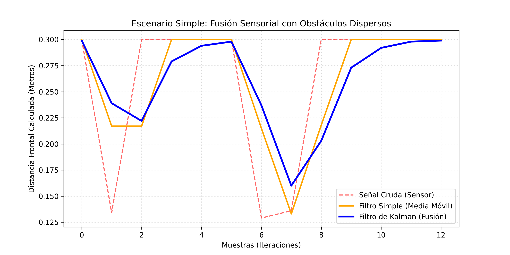
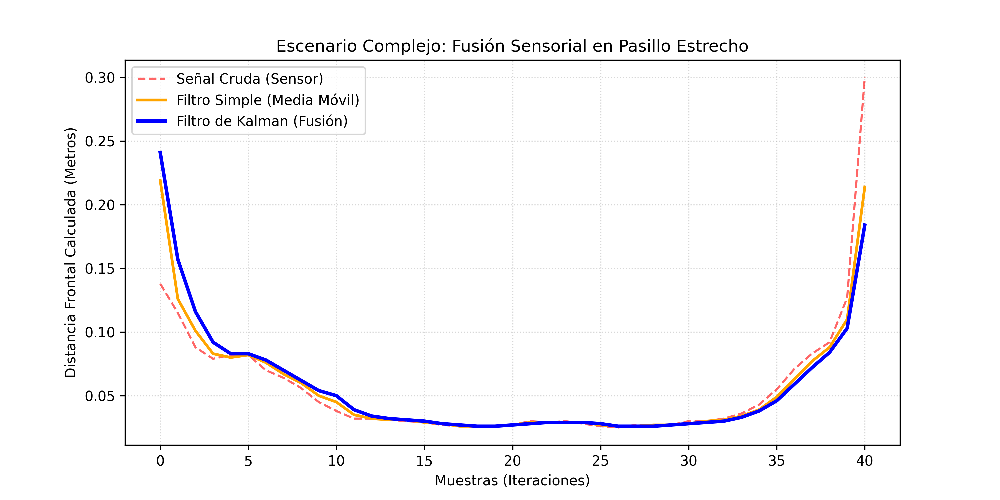

# Laboratorio 2: Navegación Reactiva con Filtrado y Fusión de Sensores en Webots

## Integrantes
- Joaquín Castro
- Matías Ruiz
- Álvaro Del Pino

---

## 1. Objetivo del Trabajo

Implementar un sistema de navegación reactiva robusto para un robot móvil diferencial (**e-puck**) en el entorno de simulación Webots. Se busca resolver el problema de la incertidumbre y el ruido de las lecturas de los sensores mediante:

- Filtrado digital con **Filtro de Media Móvil**
- Fusión sensorial con **Filtro de Kalman Escalar**
- Integración de mediciones de distancia y odometría por encoders para optimizar la evasión de obstáculos en tiempo real

---

## 2. Robot y Sensores Utilizados

Robot utilizado: **e-puck**

| Periférico | Identificador | Descripción |
|---|---|---|
| Sensores IR frontales | `ps0`, `ps7` | Valor adimensional inversamente proporcional a la distancia |
| Sensores IR laterales | `ps2`, `ps5` | Valor adimensional inversamente proporcional a la distancia |
| Encoder izquierdo | `left wheel sensor` | Rotación acumulada en radianes (θ) |
| Encoder derecho | `right wheel sensor` | Rotación acumulada en radianes (θ) |

---

## 3. Frecuencia de Muestreo

```
TIME_STEP = 32 ms
```

| Parámetro | Valor |
|---|---|
| Tiempo de muestreo ($T_s$) | $0.032\ \text{s}$ |
| Frecuencia de muestreo ($f_s$) | $\dfrac{1}{0.032} = 31.25\ \text{Hz}$ |

---

## 4. Análisis de Señales y Curva de Calibración

Los sensores IR del e-puck presentan comportamiento **no lineal** y son dependientes de la reflectancia del material.

Observaciones experimentales con cajas de madera:

- Ruido base ambiental (vacío): ~70
- Señal máxima al colisionar de frente: ~140
- La madera absorbe gran parte de la luz infrarroja

### Función de calibración (sensor crudo → metros)

```c
double ps_to_meters(double sensor_value) {
  if (sensor_value < 72) return 0.30;  // sin obstáculo detectable
  return 10.0 / sensor_value;          // zona de detección
}
```

---

## 5. Estimación del Avance mediante Encoders

Radio de rueda: $r = 0.0205\ \text{m}$

$$\Delta s_{\text{izq}} = r \cdot (\theta_{\text{izq},k} - \theta_{\text{izq},k-1})$$

$$\Delta s_{\text{der}} = r \cdot (\theta_{\text{der},k} - \theta_{\text{der},k-1})$$

$$\Delta d_k = \frac{\Delta s_{\text{izq}} + \Delta s_{\text{der}}}{2}$$

---

## 6. Filtro de Media Móvil

Para mitigar las fluctuaciones del canal infrarrojo se aplica un filtro de Media Móvil con ventana $N = 2$ (minimiza el retraso temporal):

$$z_{\text{filtrado},k} = \frac{1}{N} \sum_{i=0}^{N-1} z_{\text{raw},k-i}$$

---

## 7. Filtro de Kalman (Fusión Sensorial)

El Filtro de Kalman Escalar fusiona recursivamente la cinemática de los encoders con la distancia medida por los sensores ópticos.

### Parámetros

| Parámetro | Valor | Descripción |
|---|---|---|
| $Q$ | `0.02` | Varianza del proceso (confianza en el modelo dinámico) |
| $R$ | `0.01` | Varianza de la medición (confianza en el sensor IR) |

### Etapa de Predicción

$$\hat{d}_k^{-} = \hat{d}_{k-1} - \Delta d_k$$

$$P_k^{-} = P_{k-1} + Q$$

### Etapa de Corrección

$$K_k = \frac{P_k^{-}}{P_k^{-} + R}$$

$$\hat{d}_k = \hat{d}_k^{-} + K_k \cdot (z_{\text{filtrado},k} - \hat{d}_k^{-})$$

$$P_k = (1 - K_k) \cdot P_k^{-}$$

---

## 8. Lógica de Navegación Reactiva

| Estado | Condición | Comportamiento |
|---|---|---|
| **Camino despejado** | $\hat{d}_k > 0.12$ m | Avance en línea recta a $0.6 \times$ MAX_SPEED |
| **Evasión de obstáculo** | $\hat{d}_k \leq 0.12$ m | Giro de pivote invertido sobre su propio eje |

> Al activarse la evasión, se gatilla un **temporizador de bloqueo de maniobra de 12 frames**. La dirección del giro se determina por la diferencia de lectura entre los sensores laterales.

---

## 9. Resultados

### A. Escenario Simple (Obstáculos dispersos)

El robot navega libremente entre obstáculos dispersos, manteniendo trayectorias lineales estables. El filtro de Kalman elimina exitosamente el ruido transitorio de las lecturas ópticas, evitando falsos positivos que podrían provocar giros innecesarios.



> *Distancia estimada por el filtro de Kalman vs. lectura cruda del sensor IR — Escenario Simple.*

### B. Escenario Complejo (Pasillo Confinado en S)

En condiciones de confinamiento cerrado, el robot ejecuta giros consecutivos rápidos. La fusión cinemática suaviza los retardos propios de la media móvil, permitiendo una evasión continua y fluida a tan solo 12 cm de las paredes sin registrar ninguna colisión.



> *Distancia estimada por el filtro de Kalman vs. lectura cruda del sensor IR — Escenario Complejo (Pasillo en S).*

### Resumen de métricas

| Métrica | Escenario Simple | Escenario Complejo |
|---|---|---|
| Tasa de colisiones | 0% | 0% |
| Distancia mínima estimada (Kalman) | ~12.5 cm | ~4 cm |
| Muestras registradas | ~13 iteraciones | ~42 iteraciones |
| Activaciones de evasión | 2 | Continua (~iter. 10–35) |
| Variación señal cruda | ~0.13–0.30 m | ~0.04–0.30 m |

---

## 10. Conclusiones

El presente laboratorio demostró que la integración de técnicas de filtrado y fusión sensorial es fundamental para lograr una navegación reactiva confiable en entornos reales y simulados con ruido.

**Sobre el filtro de Media Móvil:** La ventana compacta de $N = 2$ resultó ser un balance eficiente entre la atenuación del ruido de alta frecuencia y el retraso introducido en la señal. Ventanas mayores, si bien reducen más el ruido, habrían comprometido la velocidad de respuesta ante obstáculos cercanos.

**Sobre el Filtro de Kalman Escalar:** La elección de $Q = 0.02 > R = 0.01$ refleja una mayor confianza en el sensor infrarrojo que en el modelo dinámico puro, lo cual fue adecuado dado que la odometría acumula error con el tiempo. El filtro demostró compensar eficazmente la baja reflectancia de la madera, fusionando la predicción cinemática de los encoders con las lecturas ópticas para mantener una estimación de distancia coherente y estable.

**Sobre la navegación reactiva:** El umbral de evasión a 12 cm y el bloqueo de maniobra de 12 frames probaron ser parámetros adecuados para ambos escenarios. En el pasillo en S, donde los estímulos sensoriales son continuos y simultáneos, el sistema evitó entrar en ciclos de oscilación gracias al temporizador de bloqueo, que garantiza la ejecución completa de cada maniobra de giro.

**Resultado global:** Se obtuvo una **tasa de colisiones del 0%** en ambos entornos simulados, validando que la arquitectura de tres capas —calibración, filtrado/fusión y lógica reactiva— es una solución robusta para la navegación autónoma con sensores de bajo costo y alta incertidumbre.
